# PartyPic Infrastructure Diagramm

## Gesamtübersicht

## Komponenten-Detail

### AWS Ressourcen (via Terraform)

| Ressource | Typ | Beschreibung |
|-----------|-----|--------------|
| RKE2 Server | `aws_instance` | Control Plane (K8s API + etcd) |
| RKE2 Workers | `aws_autoscaling_group` | Worker Nodes (1-10, Auto-Skalierung) |
| RDS PostgreSQL | `aws_db_instance` | Managed Database (db.t3.micro, PostgreSQL 16) |
| S3 Bucket | `aws_s3_bucket` | Bild-Speicher (Presigned URLs) |
| Elastic IP | `aws_eip` | Feste IP für Ingress |
| Security Group | `aws_security_group` | Firewall (SSH, HTTP/S, K8s API, NodePorts) |

### Kubernetes Namespaces

```mermaid
%%{init: {'flowchart': {'curve': 'stepBefore'}}}%%
flowchart TB
    subgraph ServerNode["🎛️ Server Node"]
        subgraph SYS1["kube-system"]
            CCM[AWS CCM]
            CAS[Cluster Autoscaler]
        end
    end
    
    subgraph WorkerNodes["🖧 Worker Nodes"]
        subgraph SYS2["kube-system"]
            Ingress[NGINX Ingress]
        end
        
        subgraph MON["monitoring"]
            Prom[Prometheus]
            Graf[Grafana]
            Loki[Loki]
        end
        
        subgraph ARGO["argocd"]
            ArgoCD[ArgoCD]
        end
        
        subgraph APP["party-pic"]
            Client[Client]
            Server[Server]
        end
    end
    
    style ServerNode fill:#fce4ec,stroke:#c48b9f,color:#5d4037
    style WorkerNodes fill:#e8f5e9,stroke:#81c784,color:#33691e
    style SYS1 fill:#e3f2fd,stroke:#64b5f6,color:#1565c0
    style SYS2 fill:#e3f2fd,stroke:#64b5f6,color:#1565c0
    style MON fill:#f3e5f5,stroke:#ba68c8,color:#6a1b9a
    style ARGO fill:#e0f2f1,stroke:#4db6ac,color:#00695c
    style APP fill:#fff8e1,stroke:#ffb74d,color:#e65100
```

### Deployment Pipeline (GitOps)

### Monitoring Stack

```mermaid
%%{init: {'flowchart': {'curve': 'stepBefore'}}}%%
flowchart LR
    subgraph Sources["📡 Quellen"]
        App[Server]
        Node[Nodes]
    end
    
    subgraph Collect["📥 Sammlung"]
        Prom[Prometheus]
        Loki[Loki]
    end
    
    subgraph View["👁️ Ansicht"]
        Graf[Grafana]
    end
    
    App --> Prom
    Node --> Prom
    Prom --> Graf
    Loki --> Graf
    
    style Sources fill:#fff8e1,stroke:#ffb74d,color:#5d4037
    style Collect fill:#e8f5e9,stroke:#81c784,color:#33691e
    style View fill:#e3f2fd,stroke:#64b5f6,color:#1565c0
    
    linkStyle default stroke:#37474f,stroke-width:2px
```

### Netzwerk

```mermaid
%%{init: {'flowchart': {'curve': 'stepBefore'}}}%%
flowchart LR
    Internet["🌍 Internet"]
    
    subgraph Ports["🔓 Offene Ports"]
        HTTP[":80/:443"]
        API[":6443"]
    end
    
    subgraph DB["🔒 Intern"]
        PG[":5432"]
    end
    
    Internet --> Ports
    Ports --> DB
    
    style Internet fill:#e8eef4,stroke:#455a64,color:#37474f
    style Ports fill:#e8f5e9,stroke:#81c784,color:#33691e
    style DB fill:#fce4ec,stroke:#c48b9f,color:#5d4037
    
    linkStyle default stroke:#37474f,stroke-width:2px
```

## Lokale Entwicklung

```mermaid
%%{init: {'flowchart': {'curve': 'stepBefore'}}}%%
flowchart LR
    subgraph Docker["🐳 Docker Compose"]
        Dev["💻 DevContainer"]
        DB[("🐘 PostgreSQL")]
        S3["📦 MinIO"]
    end
    
    Dev --> DB
    Dev --> S3
    
    style Docker fill:#e3f2fd,stroke:#64b5f6,color:#1565c0
    
    linkStyle default stroke:#37474f,stroke-width:2px
```

## Technologie-Stack

| Layer | Technologie |
|-------|-------------|
| **Frontend** | React 19, TypeScript, Vite 7, TailwindCSS 4 |
| **Backend** | NestJS 11, TypeScript, Passport JWT |
| **Database** | PostgreSQL 16 (RDS) |
| **Storage** | AWS S3 / MinIO (dev) |
| **Container** | Docker (Multi-Stage Builds) |
| **Orchestration** | RKE2 (Kubernetes 1.29+) |
| **IaC** | Terraform + AWS Provider |
| **GitOps** | ArgoCD |
| **Monitoring** | Prometheus, Grafana, Loki |
| **Ingress** | NGINX Ingress Controller |
| **Auto-Scaling** | Cluster Autoscaler + HPA |
